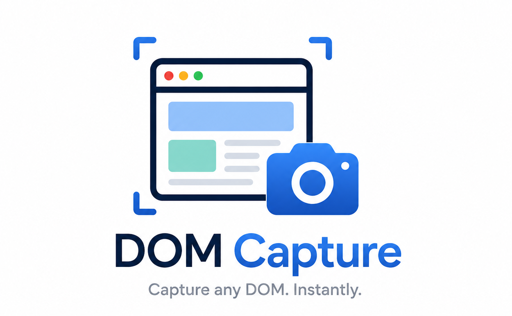

<p align="center">
  
</p>

<h1 align="center">DOM Capture</h1>

<p align="center">
  Chrome extension to capture DOM elements or full pages as PNG or PDF.
</p>

<p align="center">
  <a href="docs/README.ko.md">한국어</a> |
  <a href="docs/README.ja.md">日本語</a> |
  <a href="docs/README.zh_CN.md">简体中文</a> |
  <a href="docs/README.zh_TW.md">繁體中文</a> |
  <a href="docs/README.de.md">Deutsch</a> |
  <a href="docs/README.fr.md">Français</a> |
  <a href="docs/README.es.md">Español</a> |
  <a href="docs/README.pt_BR.md">Português (Brasil)</a> |
  <a href="docs/README.ru.md">Русский</a>
</p>

---

## Features

- **Element Picker** — hover over any element and click to capture it
- **CSS / XPath Selector** — capture a specific element by selector
- **Region Capture** — drag a rectangle over the viewport to capture a selected area
- **Viewport Capture** — screenshot the current visible area
- **Full Page Capture** — scroll-and-stitch screenshot of the entire page
- **Export** — save as PNG or PDF, or copy to clipboard

## Installation

### Option A — Chrome Web Store

Install directly from the [Chrome Web Store](https://chromewebstore.google.com/detail/dom-capture/cmknlcgmcbinbngoijkmbihpohjkokda) and click **Add to Chrome**.

### Option B — Manual (Developer Mode)

1. **Download or clone this repository**
   ```bash
   git clone https://github.com/nkwoo/dom-capture.git
   ```

2. **Open Chrome Extensions page**
   Navigate to `chrome://extensions`

3. **Enable Developer Mode**
   Toggle the **Developer mode** switch in the top-right corner.

4. **Load the extension**
   Click **Load unpacked** and select the cloned repository folder.

5. **Pin the extension** (optional)
   Click the puzzle icon in the Chrome toolbar and pin **DOM Capture** for easy access.

## Usage

| Task | How |
|------|-----|
| Capture an element | Click the extension icon → **Pick Element** → click any element on the page |
| Capture by selector | Click the extension icon → enter a CSS or XPath selector → **Capture** |
| Capture a region | Click the extension icon → **Region** tab → drag to select an area → **Capture** |
| Capture viewport | Click the extension icon → **Viewport** tab → **Capture** |
| Capture full page | Click the extension icon → **Full Page** tab → **Capture** |
| Download | After capture, click **Download** (PNG or PDF) |
| Copy to clipboard | After capture, click **Copy** (PNG only) |

## Contributing

Contributions are welcome!

1. Fork the repository.
2. Create a feature branch: `git checkout -b feat/your-feature`
3. Commit your changes: `git commit -m "feat: describe your change"`
4. Push the branch: `git push origin feat/your-feature`
5. Open a Pull Request against `main`.

Please keep pull requests focused — one feature or fix per PR.

## Reporting Issues

Found a bug or have a feature request? [Open an issue](../../issues/new) and include:

- Chrome version (`chrome://version`)
- Extension version (visible on `chrome://extensions`)
- Steps to reproduce
- Expected vs. actual behavior
- Screenshots or screen recordings if applicable

## License

[MIT](LICENSE)
